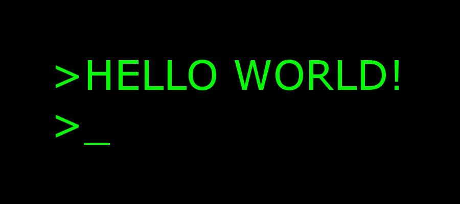

</a>

---

<!--img src="https://komarev.com/ghpvc/?username=Olivier-true&label=Followers&color=008042&style=flat&label=Followers" alt="Followers"></a>
</a>
</a-->

## À propos de moi

- 👨‍🎓  Je suis un lycéen français, passionné de programmation et de cybersécurité.
- ⏳  Je Programme depuis la classe de 3ème.
- 👨‍💻 J’ai commencé par le Python puis le C#.
- 🔐 J’apprécie de travailler des notions telles que la cryptographie avec les algorithmes AES et RSA et le réseau avec les protocoles TCP et HTTP-S principalement.
---

### 🛠  Langages et outils utilisés:
&nbsp;
&nbsp;
&nbsp;
&nbsp;
&nbsp;
&nbsp;
&nbsp;
&nbsp;
&nbsp;
&nbsp;

---
## 💼 Expérience en entreprise
J'ai été amené à faire un stage l'année dernière chez Capsoft durant 3 semaines durant lequel j'ai pu développer des projets simples tel qu'un logiciel fenêtré en C# gérant des raccourcis de répertoires de l'explorer windows, un programme de journalisation du temps d'activité des machines sur un réseau VPN dans l'entreprise ainsi qu'un programme d'archivage des répertoires de sauvegarde automatique (grâce à 7z.exe) dont les flux de sortie de console étaient redirigés vers des logs pour détecter les fichiers ouverts et donc les erreurs potentielles.

---
## 📊 Mes Statistiques

---

## 📦 My Last Repositry

- <a href="https://github.com/Olivier-true/Flask-SocketIO-Messaging-Application">Flask-SocketIO-Messaging-Application</a>

---

[Compteur de vues](https://ipipip-gh.0xsql.repl.co/views.png)
